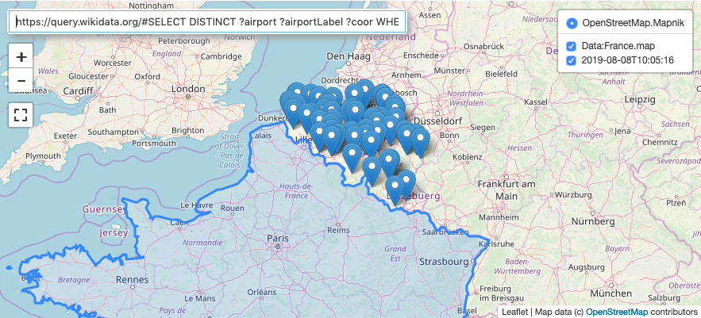

# IPyMaps

This is a dedicated repository to host a somewhat experimental project aiming to build a configurable map-based search interface sitting on the shoulders of [ipyleaflet](https://github.com/jupyter-widgets/ipyleaflet), and somewhat reminescent of Google Maps and friends. It first started as a notebook inside a [fork](https://github.com/deeplook/voila) of [voila](https://github.com/QuantStack/voila). The immediate plan is to turn this into a contribution for the [Voila Gallery](https://voila-gallery.org/services/gallery/), really soon. A [binder version](https://mybinder.org/v2/gh/deeplook/voila/master?urlpath=voila/render/notebooks/ipymaps.ipynb} is available (only) there, for now.

# 
